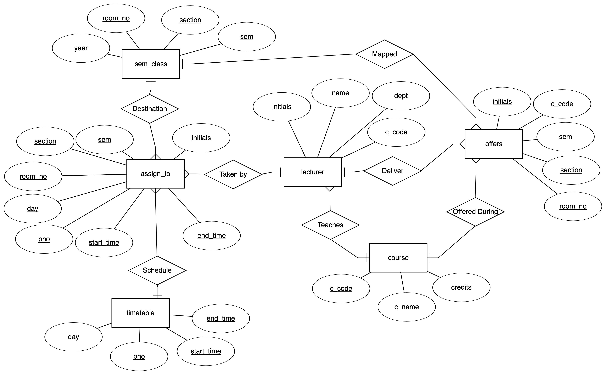
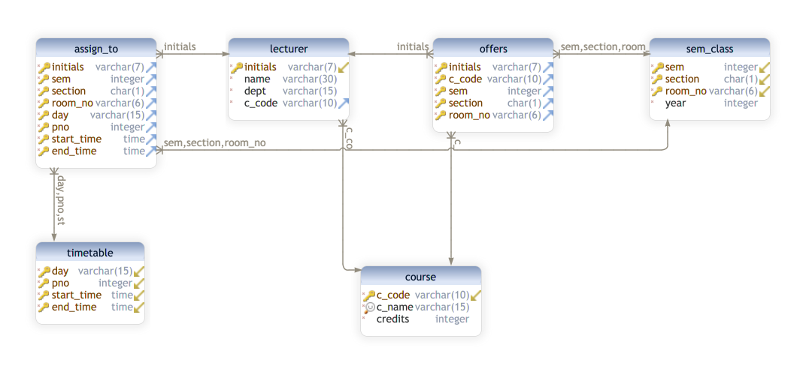

<div align="center">
<h1>Timetable Management System</h1>
<p>
DBMS Laboratory with Mini Project (18CSL58)
</p>
</div>

## About Project

A simple DBMS project which uses a database to store all the various timetables of a college or university. It also provides a web interface for students and lecturers to use.

## Team Details

- Patel Kavan 1JS18IS063
- Rajiv Ranjan Singh 1JS18IS072

## User Requirements

- The college has many departments, each of which has many faculty members that take classes for various semesters. We keep a record of the timings of all classes taken by faculties of all semesters, in all departments.

- The database will store the timetables of all classes in all semesters of all departments, from which the timetables of all teachers and lab instructors can be extracted.

- Any teacher can view her free slots as well as that of any other faculty member. This can also be accessed by students.

- If the timetable of a faculty is changed or they have any other works or are absent, the database can be updated and the timetable of the respective teacher is reorganized.

- The faculty will have an option to show that they are not free at any particular time if they wish to do so.

- The database also keeps track of all vacant classes at any particular time, so that it can be used by any other teacher if the need arises.

## Entity Relationship Diagram

<div align="center">

</div>

## Relational Schema

<div align="center">

</div>

## Details

Number of Tables Created: 6

| Table No. | Table Name | No. of Attributes | No. of Tuples Inserted |
| :-------: | :--------: | :---------------: | :--------------------: |
|     1     | ASSIGN_TO  |         8         |          168           |
|     2     |   COURSE   |         3         |           7            |
|     3     |  LECTURER  |         4         |           26           |
|     4     |   OFFERS   |         5         |           40           |
|     5     | SEM_CLASS  |         4         |           8            |
|     6     | TIMETABLE  |         4         |           30           |

## Technologies

- Frontend: HTML, CSS and Bootstrap
- Backend: PHP
- Query Language: SQL
- RDBMS: PostgreSQL

## Usage

- Start PostgreSQL service using the command

```shell
brew services start postgresql
```

To stop the service use the command

```shell
brew services stop postgresql
```

- Make sure to set the `DATABASE_NAME`, `DATABASE_PASS` and `DATABASE_USER` parameters in the `pg_connect` function in the `request.php` file.

- Open PostgreSQL terminal using the command

```shell
psql postgres
```

Create a new database using the command

```sql
CREATE DATABASE {DATABASE_NAME};
```

- Load the `demo.sql` file into PostgreSQL using the command

```shell
psql -U {DATABASE_USER} {DATABASE_NAME} < demo.sql
```

- Run PHP server inside `src` folder which has `index.php` file using the command

```shell
php -S localhost:3000
```

## License

[MIT](https://github.com/iamrajiv/Timetable-Management-System/blob/master/LICENSE)
